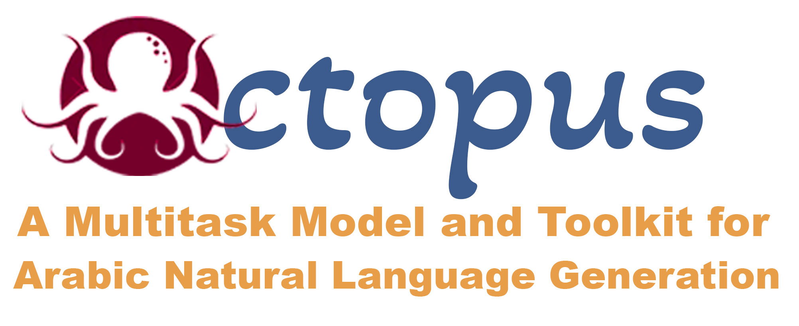
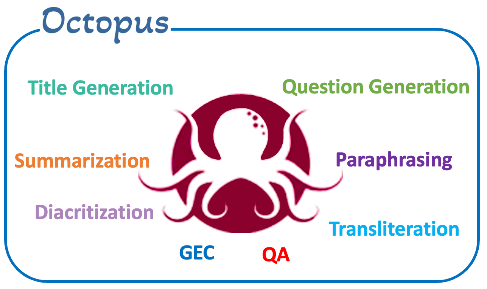

<p align="center">
    <br>
    
    <br>
<p>

<p align="center">
<a href="https://github.com/UBC-NLP/octopus/releases">
        
    </a>

<a href="https://demos.dlnlp.ai/octopus">
        
    </a>
<a href="https://github.com/UBC-NLP/octopus/blob/main/LICENSE"></a>
<a href='https://octopus.readthedocs.io/en/latest/?badge=latest'></a>
<a href="https://github.com/UBC-NLP/octopus/stargazers"></a>
<a href="https://github.com/UBC-NLP/octopus/network"></a>

</p>
 



Octopus is a neural machine generation toolkit for Arabic Natural Lnagauge Generation (NLG) that described in our ArabiNLP 2023 paper: [**OCTOPUS: A Multitask Model and Toolkit for Arabic Natural Language Generation**](https://arxiv.org/abs/2310.16127v1). Octopus designed for eight machine generation tasks, encompassing diacritization, grammatical error correction, news headlines generation, paraphrasing, question answering, question generation, and
transliteration. This comprehensive package includes a Python library along with associated command-line scripts.

<br>

## Requirements and Installation
- To install octopus and develop directly using pip:
```shell
    pip install -U octopus
```
- To install octopus and develop directly GitHub repo using pip:
```shell
    pip install -U git+https://github.com/UBC-NLP/octopus.git
```
- To install octopus and develop locally:
```shell
    git clone https://github.com/UBC-NLP/octopus.git
    cd octopus
    pip install .
```
## Getting Started
The [full documentation](https://octopus.readthedocs.io/en/latest/) contains instructions for getting started, translation using diffrent methods, intergrate OCTOPUS with your code, and provides more examples.

## Colab Examples
### (1) Command Line Interface


### (2) Integrate Octopus with your python code


## License
octopus(-py) is Apache-2.0 licensed. The license applies to the pre-trained models as well.

## Citation
If you use OCTOPUS toolkit or the pre-trained models for your scientific publication, or if you find the resources in this repository useful, please cite our paper as follows (to be updated):
```
 @misc{elmadany2023octopus,
      title={Octopus: A Multitask Model and Toolkit for Arabic Natural Language Generation}, 
      author={AbdelRahim Elmadany and El Moatez Billah Nagoudi and Muhammad Abdul-Mageed},
      year={2023},
      eprint={2310.16127},
      archivePrefix={arXiv},
      primaryClass={cs.CL}
}

```


## Acknowledgments
We gratefully acknowledge support from the Natural Sciences and Engineering Research Council of Canada (NSERC; RGPIN-2018-04267), the Social Sciences and Humanities Research Council of Canada (SSHRC; 435-2018-0576; 895-2020-1004; 895-2021-1008), Canadian Foundation for Innovation (CFI; 37771), [ComputeCanada (CC)](www.computecanada.ca),   [UBC ARC-Sockeye](https://doi.org/10.14288/SOCKEYE) and Advanced Micro Devices, Inc. (AMD). Any opinions, conclusions or recommendations expressed in this material are those of the author(s) and do not necessarily reflect the views of NSERC, SSHRC, CFI, CC, AMD, or UBC ARC-Sockeye. 
